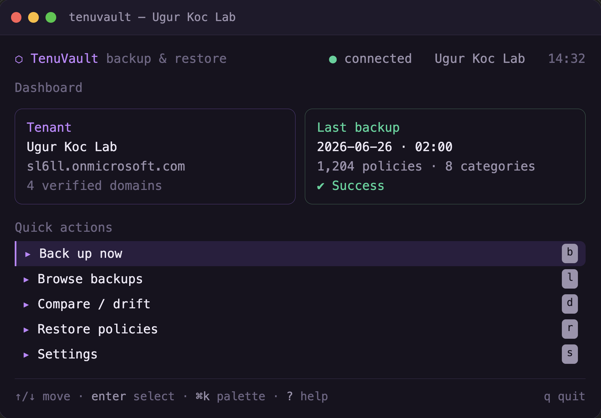

<h1 align="center">TenuVault TUI</h1>

<p align="center">
  Back up, restore, compare, and sync Microsoft Intune configuration<br>
  from a single terminal binary — no PowerShell, no cloud setup.
</p>

<p align="center">
  <a href="https://github.com/ugurkocde/TenuVault-TUI/releases/latest"></a>
  <a href="https://github.com/ugurkocde/TenuVault-TUI/actions/workflows/ci.yml"></a>
  <a href="go.mod"></a>
  
  <a href="LICENSE"></a>
</p>

<!-- SCREENSHOT: drop your capture at docs/screenshot.png (PNG, ~1200px wide).
     It renders here as the hero image. A shot of the dashboard works best. -->
<p align="center">
  
</p>

TenuVault TUI signs in to Microsoft Graph, backs up your Intune policies to local
TenuVault-format folders, compares backups for drift, restores policies back to a
tenant, and syncs policies from one tenant to another — all from one binary.
Built with Go and the [Charm](https://charm.land) stack (Bubble Tea, Lip Gloss).

## Contents

- [Highlights](#highlights)
- [Install](#install)
- [Usage](#usage)
- [Coverage](#coverage)
- [Headless (automation / CI)](#headless-automation--ci)
- [Tenant sync](#tenant-sync)
- [Permissions](#permissions)
- [Configuration](#configuration)
- [Security](#security)
- [Backup format](#backup-format)
- [Development](#development)
- [License](#license)

## Highlights

- **One self-contained binary.** Sign in with your browser (delegated, no app
  registration required) or with an app registration (client secret or
  certificate) entered right in the UI. Device code sign-in is intentionally not
  supported (phishing risk).
- **Full backups.** 27 Intune policy types to portable, per-policy JSON — script
  bodies, settings-catalog values, administrative-template definition values, and
  security-baseline intent settings are all fetched in full, with a
  `metadata.json` manifest and a `backup.log`.
- **Honest results.** Every category reports `Success`, `CompletedWithWarnings`,
  or `Failed` with the exact Graph error (e.g. a missing scope) — no silent drops.
- **Restore that never overwrites.** Dry-run preview, explicit confirmation, and
  a `[Restored]` name prefix. Conditional Access policies are restored disabled.
- **Drift comparison.** Compare any two backups with severity highlighting.
- **Tenant-to-tenant sync.** Promote policies from one tenant to another (e.g.
  dev to prod) from a live tenant or a saved backup. Create-only — it never
  overwrites existing policies.
- **Signed and notarized.** macOS builds are Developer ID-signed and Apple-
  notarized; install via Homebrew, `.pkg`, `.dmg`, or a raw binary.
- **Scriptable.** `backup` and `restore` subcommands run headless for CI and
  scheduling. Mouse, scrollbars, and keyboard navigation throughout.

## Install

**Homebrew (macOS, recommended):**

```sh
brew install ugurkocde/UgurLabs/tenuvault
```

**macOS installers:** download a signed, notarized `.pkg` (installs `tenuvault`
to `/usr/local/bin`) or `.dmg` from the
[latest release](https://github.com/ugurkocde/TenuVault-TUI/releases/latest).
Both are Apple-notarized, so they open without Gatekeeper warnings.

**Linux:** download the `.deb` (Debian/Ubuntu) or `.rpm` (Fedora/RHEL) for your
architecture from the [latest release](https://github.com/ugurkocde/TenuVault-TUI/releases/latest),
or use the raw binary/tarball.

```sh
sudo dpkg -i tenuvault_*_linux_amd64.deb    # or: sudo rpm -i tenuvault_*_linux_amd64.rpm
```

**Windows:** download `tenuvault_*_windows_amd64.zip` (amd64 / arm64), extract,
and run `tenuvault.exe`. The binary is currently unsigned, so Windows may show a
SmartScreen prompt — choose "More info" then "Run anyway". A `winget` package is
in progress.

**With Go:**

```sh
go install github.com/ugurkocde/TenuVault-TUI@latest
```

**From source:**

```sh
git clone https://github.com/ugurkocde/TenuVault-TUI.git
cd TenuVault-TUI
go build -o tenuvault .
```

## Usage

```sh
tenuvault
```

On first run, choose a sign-in method: interactive (opens your browser) or app
registration (enter tenant id, client id, and a client secret or certificate
path in the form). After signing in, the dashboard shows your tenant and last
backup.

Flags:

| Flag           | Description                                   |
| -------------- | --------------------------------------------- |
| `-tenant`      | Tenant id or domain (overrides config)        |
| `-backup-root` | Directory to store backups (overrides config) |
| `-version`     | Print version and exit                        |

Keys: `b` back up, `l` browse, `d` compare, `r` restore, `y` sync, `t` tenants,
`s` settings, arrow keys / `j` `k` to move, `space` to toggle, `enter` to
select, `esc` to go back, `q` to quit, `?` for help. The mouse works too — click
a list row to select it and scroll with the wheel.

## Coverage

Configuration (device configurations, settings catalog, administrative
templates, compliance, endpoint security baselines), scripts (Windows, macOS
shell, proactive remediations, custom attributes), enrollment and updates
(Autopilot, enrollment configurations, feature/quality/driver updates), tenant
administration (scope tags, device categories, terms and conditions,
notification templates, assignment filters), apps (app configuration, app
protection for iOS/Android/Windows, Windows information protection, app
categories), and conditional access.

All 27 types are restorable. Administrative templates and endpoint-security
baselines use multi-part creates (the policy plus its settings, applied via
`updateDefinitionValues` / `createInstance`); enrollment configurations restore
best-effort (default/singleton configs can't be recreated).

## Headless (automation / CI)

`backup` and `restore` run without the TUI for scheduling and pipelines. Use
app-registration credentials (interactive sign-in needs a browser):

```sh
export AZURE_TENANT_ID=...   AZURE_CLIENT_ID=...   AZURE_CLIENT_SECRET=...

tenuvault backup --out ./backups --assignments
tenuvault backup --categories deviceConfigurations,compliancePolicies
tenuvault restore --backup ./backups/backup-2026-06-27-020000 --prefix "[Restored] "
```

`backup` exits non-zero if a backup fails; `restore` exits non-zero if any policy
fails to create. Tenant-to-tenant sync remains interactive (it needs two
tenants).

## Tenant sync

To copy policies between tenants, add each tenant under `Tenants` (`t`) — sign in
interactively or with app credentials. Then choose `Sync to another tenant`
(`y`), pick a source (a connected tenant or a saved backup), select whole types
or drill in to pick individual policies, choose a target tenant, pick whether to
keep the original name or add a prefix, and confirm.

Sync is **create-only and never overwrites**: it only creates new policies in the
target and never reads or modifies existing ones. Conditional Access arrives
disabled, and assignments are not copied (group ids differ between tenants). The
target sign-in needs write scopes (`DeviceManagement*.ReadWrite.All`). Tenant
connections are remembered across launches (metadata only — no tokens or secrets
are stored).

## Permissions

Interactive sign-in requests the scopes below explicitly, so the signed-in admin
is prompted to consent to them in each tenant (the first tenant and any tenant
you add for sync). App-only (secret/certificate) sign-in uses `.default` —
consent those permissions on the app registration instead. The relevant scopes
are:

- `DeviceManagementConfiguration.ReadWrite.All`
- `DeviceManagementApps.ReadWrite.All`
- `DeviceManagementServiceConfig.ReadWrite.All`
- `DeviceManagementScripts.ReadWrite.All`
- `DeviceManagementRBAC.ReadWrite.All` (scope tags)
- `Policy.ReadWrite.ConditionalAccess`

If a scope is missing, the affected category is reported as failed on the backup
summary with the exact Graph error, so you can see what to consent.

## Configuration

Settings are stored at the OS config dir under `tenuvault/config.json` (for
example `~/Library/Application Support/tenuvault/config.json` on macOS).
Credentials are never written to disk — secrets are read from the environment:

| Variable                            | Purpose                             |
| ----------------------------------- | ----------------------------------- |
| `AZURE_TENANT_ID`                   | Target tenant                       |
| `AZURE_CLIENT_ID`                   | Custom app registration (optional)  |
| `AZURE_CLIENT_SECRET`               | Client secret (enables secret auth) |
| `AZURE_CLIENT_CERTIFICATE_PASSWORD` | Certificate password (if encrypted) |

## Security

- **No secrets on disk.** Client secrets and certificate passwords are read from
  the environment and held only in memory; only non-sensitive connection
  metadata (tenant id, client id, sign-in method) is persisted.
- **No device code flow.** Removed deliberately to avoid device-code phishing.
- **Restore and sync are create-only.** Nothing is ever patched or deleted in a
  tenant; new policies use a `[Restored]` prefix by default and Conditional
  Access is created disabled.
- All Graph calls target the `beta` endpoint to cover the full policy surface.

## Backup format

```
backup-YYYY-MM-DD-HHMMSS/
  metadata.json
  DeviceConfigurations/<policy name>.json
  CompliancePolicies/<policy name>.json
  ConfigurationPolicies/<policy name>.json
  ...
```

Each policy file is the verbatim Graph JSON (with API noise removed) so it
restores cleanly and stays compatible with the TenuVault portal.

## Development

```sh
go build ./...
go test ./...
go test -race ./...
```

CI runs formatting, `go vet`, race tests, and a cross-platform build on every
push. Releases are cut by pushing a `v*` tag (see `SECRETS.md` for the signing
and notarization setup).

## License

MIT — see [LICENSE](LICENSE).
